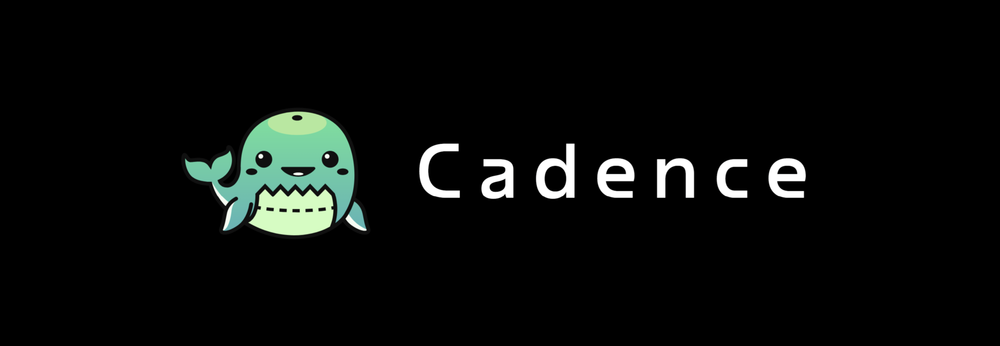

# Cadence

**A lightweight web platform for engineering managers to run their day-to-day work effectively.**

Cadence is your control centre for management work—bringing together tasks, meetings, delivery data, and personal growth in one clear, organised place.

## What is Cadence?

Cadence helps engineering managers:

- 📋 **Stay organised** - Track tasks, follow-ups, and commitments in one place
- 👥 **Manage teams** - Keep context on people, 1:1s, and team dynamics
- 📊 **Understand delivery** - Track capacity and delivery patterns over time
- 🎯 **Invest in growth** - Set and track your own career progression goals

### What Cadence is NOT

- ❌ Not a Jira replacement
- ❌ Not an HR system
- ❌ Not a performance management tool
- ❌ Not an AI-driven decision platform

Cadence supports good management habits—it doesn't automate judgement.

## Features

### 📋 Task Management
- Time-based task views (today, this week, this month)
- Track overdue and upcoming work
- Link tasks to people, teams, meetings, or projects
- Automatic task creation from meeting action items

### 👥 Team & People Management
- Manage multiple teams and team members
- Track team composition and context
- Configure recurring 1:1s
- Maintain people-related notes and history

### 🤝 Meeting Management
- Capture meeting notes and decisions
- Create action items directly from meetings
- Link meetings to people, teams, and projects
- View meeting history and outcomes

### 📊 Project & Delivery Tracking
- Track delivery periods (sprints/iterations)
- Log planned vs actual capacity
- Visualize delivery trends over time
- Get warnings about over-planning or capacity drops

### 🌱 Personal Career Progression
- Define short, mid, and long-term goals
- Track actions toward each goal
- Build historical context of your growth
- Link goals to projects and learning activities

## Contributing

Contributions are welcome! Please see our [Contributing Guidelines](CONTRIBUTING.md) *(coming soon)* for details.

## License

This project is currently under development. License information will be added soon.

## Target Audience

Cadence is built for:

- Engineering Managers
- Tech Leads with people-management responsibilities
- Senior Engineers transitioning into management
- Managers leading multiple teams

## Contact & Support
- **Project Board:** [GitHub Projects](https://github.com/users/shiphrahx/projects/2)

---

Built with ❤️ for engineering managers who want to stay organized and invest in their teams.
